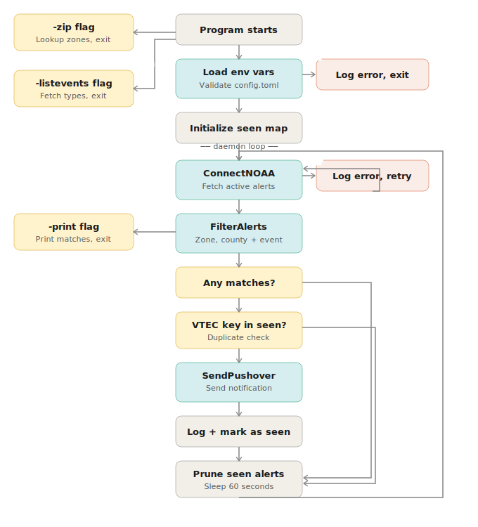

# weatherwatch

A command-line daemon that polls the National Weather Service (NWS) API for active severe weather alerts in a NWS forecast zone, sending push notifications via [Pushover](https://pushover.net) and structured JSON to stdout when a configured alert type is issued.

> ⚠️ **Disclaimer:** weatherwatch is a personal learning project intended for educational and recreational use only. It should not be relied upon as a primary source of severe weather alerts or for any life-safety decisions. Always monitor official sources such as the [National Weather Service](https://www.weather.gov), local emergency management agencies, and NOAA Weather Radio for authoritative, real-time severe weather information. The developer makes no guarantees regarding the accuracy, timeliness, or completeness of alerts delivered by this application.

## Features

- Polls `api.weather.gov` for active alerts at 60 second intervals
- Outputs the full matched alert as JSON to stdout for every new notification. Suitable for piping into other tools.
- Filters alerts by user configurable NWS zone/county code and event type (e.g. Tornado Warning, Flash Flood Warning)
- Sends push notifications to your phone via Pushover when a new matching alert is found
- Avoids duplicate notifications for alerts already seen using an in-memory cache with automatic expiration
- Looks up your NWS zone/county code from a zip code (no need to know them ahead of time)
- Lists all valid NWS alert event types so you know what events to put in your config
- Structured logging to stderr, designed to run as a systemd service with automatic log capture via journald

## Requirements
 
- Linux (binaries are built and tested for Linux only)
- A [Pushover](https://pushover.net) account
- A Pushover Application Token and User Key (see [Pushover setup](#pushover-setup) below)

## Quick Setup

For anyone who just wants to get running fast — full details for each step are further down.

**1. Get the binary**

Download the latest Linux binary from the [Releases](https://github.com/biggen1684/weatherwatch/releases) page, or build from source:

```bash
git clone https://github.com/biggen1684/weatherwatch.git
cd weatherwatch
go build -o weatherwatch .
```

**2. Set your environment variables**

```bash
export PUSHOVER_API_KEY="your_app_token_here"
export PUSHOVER_USER_KEY="your_user_key_here"
export WEATHERWATCH_USER_AGENT="weatherwatch (you@example.com)"
```

**3. Configure your zone, county, and events**

```bash
cp config.example.toml config.toml
./weatherwatch -zip <your_zip_code>
./weatherwatch -listevents
nano config.toml
```

**4. Run it**

```bash
./weatherwatch
```


## In-depth Installation and Configuration
 
### Pre-built binary (Linux)
 
Download the latest Linux binary from the [Releases](https://github.com/biggen1684/weatherwatch/releases) page.
 
> **Note:** weatherwatch is currently only tested and distributed for Linux. It relies on environment variables for configuration secrets and Windows handles these differently (`setx` or the System Properties GUI rather than `export`). Windows support hasn't been tested — building from source on Windows may work, but isn't guaranteed.

### Build from source
 
Requires Go 1.21 or later (uses `log/slog`).
 
```bash
git clone https://github.com/biggen1684/weatherwatch.git
cd weatherwatch
go build -o weatherwatch .
```

### Environment Variables

weatherwatch requires three environment variables to be set. These are not stored in `config.toml` since these are secrets.

| Variable | Purpose |
|---|---|
| `PUSHOVER_API_KEY` | Your Pushover Application Token |
| `PUSHOVER_USER_KEY` | Your Pushover User Key |
| `WEATHERWATCH_USER_AGENT` | A contact string sent to the NWS API, e.g. `weatherwatch (you@example.com)` |

>**Note:** NWS requires a `User-Agent` header identifying who's making requests in case they need to reach you about unusual traffic. Technically, you can put just about anything here including a fake email.  However, they will eventually require an API key per their own [authentication documentation](https://www.weather.gov/documentation/services-web-api) which can be included in this field in the future.

The location you store these three environment variables will depend on your chosen method of running the program:  

**1. Running directly (shell, screen, nohup):** Set these in your shell profile (`~/.bashrc`, `~/.profile`) so they persist across reboots, or export them before running for a one-off:

```bash
export PUSHOVER_API_KEY="your_app_token_here"
export PUSHOVER_USER_KEY="your_user_key_here"
export WEATHERWATCH_USER_AGENT="weatherwatch (you@example.com)"
```

**2. Running via systemd:**  See [Running Long-Term](#running-long-term) below.

### Pushover Setup

1. Create a free account at [pushover.net](https://pushover.net)
2. Your **User Key** is shown on your dashboard after logging in
3. Create an **Application** (also from the dashboard) to get an **API Token** — this becomes `PUSHOVER_API_KEY`

### Configuration

Copy the example config and fill in your values:

```bash
cp config.example.toml config.toml
```

`config.toml` fields:

```toml
# Two-letter state abbreviation for your location (e.g. FL, AL, GA).
# Note: weatherwatch is designed for land-based alerts only. NWS marine
# area codes are not supported.
area = "CA"

# Your NWS forecast zone code — see "Finding Your Zone" below
zone = "CAZ368"

# Your NWS forecast county code — see "Finding Your Zone" below
county = "CAC037"

# Event types to notify on — see "Listing Valid Events" below
events = [
    "Tornado Warning",
    "Severe Thunderstorm Warning",
    "Flash Flood Warning",
    "Hurricane Warning"
]
```

## Finding Your Zone

If you don't know your NWS zone code, run weatherwatch with the `-zip` flag and your zip code:

```bash
./weatherwatch -zip 90210
```

This looks up the latitude/longitude for that zip, queries the NWS API, and prints your zone/county codes. You have to add both the zone and county codes to `zone` and `county` fields in `config.toml`.

> **Note:** zip-code-to-coordinate lookups use the geographic centroid of the zip code's boundary. For zip codes covering narrow areas like barrier islands, this can occasionally resolve to a marine zone instead of land. weatherwatch will warn you if this happens — try another nearby zip code if this happens.

## Listing Valid Events

To see every alert event type the NWS API recognizes:

```bash
./weatherwatch -listevents
```

Copy whichever event names are relevant to you into the `events` array in `config.toml`. Event names must match exactly (including capitalization). Each event must be inside quotes and comma separated.

## Usage

### Normal operation (manual mode - good for testing deployment)

```bash
./weatherwatch
```

Runs continuously, polling NWS every 60 seconds, sending Pushover notifications for new matching alerts. Designed to run in the background — see [Running Long-Term](#running-long-term) below.

### Flags

| Flag | Description |
|---|---|
| `-zip <zipcode>` | Look up your NWS zone/county codes from a zip code, then exit |
| `-listevents` | Print all valid NWS alert event type strings, then exit |
| `-print` | Fetch alerts, print any matching your config, then exit (no notifications sent) |
| `-debug` | Print raw API responses for troubleshooting |

`-zip`, `-listevents`, and `-print` are one-shot utility commands — none of them start the long-running daemon loop.

### Running Long-Term

weatherwatch is designed to run continuously. Since it's a single process holding state in memory (which alerts have already been notified about), it needs to keep running rather than being re-invoked periodically via cron or manually.

A few options, in increasing order of robustness:

**`screen` or `tmux`** — good for quick/manual use on a machine you're logged into directly. Needs `screen` installed:

```bash
screen -S weatherwatch
./weatherwatch
# Ctrl+A then d to detach — output continues to accumulate in the screen buffer
```

**`nohup`** — survives terminal closure, doesn't survive a reboot:

```bash
nohup ./weatherwatch &
# nohup redirects stdout to nohup.out by default
```

**`systemd`** (recommended for long-term/unattended use) — survives reboots and restarts automatically on crash. A service file is included as `weatherwatch.service`.

1. Edit the paths and username in `weatherwatch.service` to match your deployment

2. Create a `.env` file alongside the binary with your three environment variables:

```bash
   nano /home/user/weatherwatch/.env
```

   Paste in your values:

```bash
   PUSHOVER_API_KEY=your_app_token_here
   PUSHOVER_USER_KEY=your_user_key_here
   WEATHERWATCH_USER_AGENT=weatherwatch (you@example.com)
```

   Restrict its permissions since it contains secrets:

```bash
   chmod 600 .env
```

   The `weatherwatch.service` service file references this `.env` file with `EnvironmentFile=`.

3. Install and start the service:

```bash
   sudo cp weatherwatch.service /etc/systemd/system/
   sudo systemctl daemon-reload
   sudo systemctl enable --now weatherwatch
```

4. Check status and logs:

```bash
   sudo systemctl status weatherwatch
   journalctl -u weatherwatch -f
```

## Logging

weatherwatch writes structured logs to stdout using Go's `log/slog`. This is separate from the one-shot utility flags (`-zip`, `-listevents`, `-print`), which print directly to the console since they're interactive commands.

When run directly or under `screen`/`nohup`, logs appear in the terminal. When run under systemd, journald captures stdout automatically — view logs with `journalctl -u weatherwatch -f`. journald also handles log rotation and retention on its own, so no manual log management is needed.

Logged events:
- Startup/configuration failures
- Failed connections to the NWS API
- Failed Pushover notifications
- Successfully sent notifications (event type, headline, alert ID, event expiration)

## Project structure

```
weatherwatch/
├── main.go                # Entry point, flag parsing, daemon loop
├── config.example.toml    # Template config — copy to config.toml
├── weatherwatch.service   # systemd service file
├── weatherwatch_flow.svg  # Program flowchart (see Logic Flow below)
├── LICENSE                # MIT
└── api/                   # weather package
    ├── config.go           # Config struct, loading, validation
    ├── env.go               # Environment variable helpers
    ├── zip.go               # Zip code validation and geocoding
    ├── zone.go              # Zip-to-NWS-zone lookup
    ├── alerts.go            # NWS alert fetching, filtering, seen-alert tracking
    ├── pushover.go          # Pushover notification sending
```

## Logic Flow



## License

MIT
